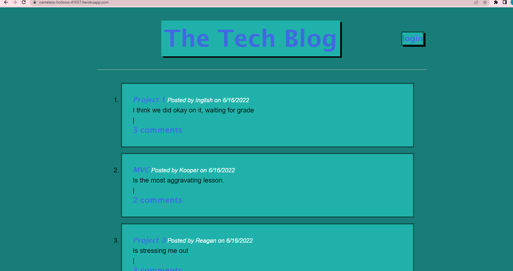

# Tech-Blog-MVC

##Description

A CMS style blog similar to a Wordpress site, where various different users can create an account and post blog posts. Users can also edit and delete their own posts. It also allows them to comment on posts from other users.

## Table of contents
- [Description](#Description)
- [Installation](#Installation)
- [Usage](#Usage)
- [Contributors](#Contributors)
- [Repository Link](#Repository)
- [Badges](#Badges)

## Installation

Link to app:
https://nameless-hollows-41057.herokuapp.com/

## Usage

Link to view Demo here: 
https://drive.google.com/file/d/1xF7-wnCjJsslAnVHg3oqbzSvtoi3S0Wv/view

## Contributers

Inglish Foust

## Respository Link

https://github.com/inglish2022/Tech-Blog-MVC

 

# Badges

